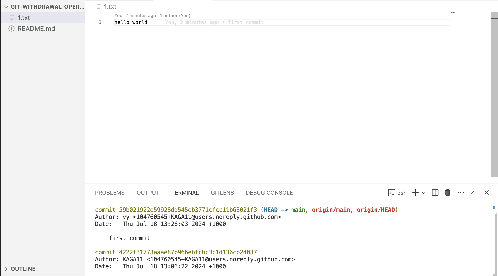
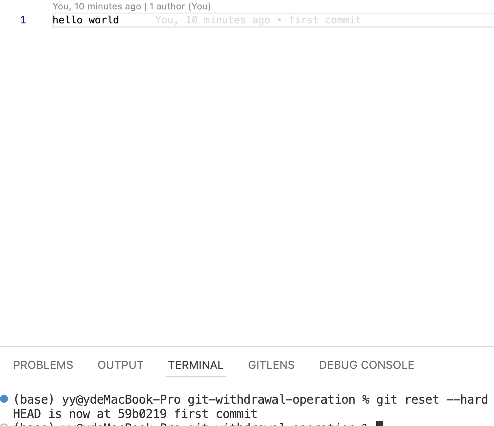
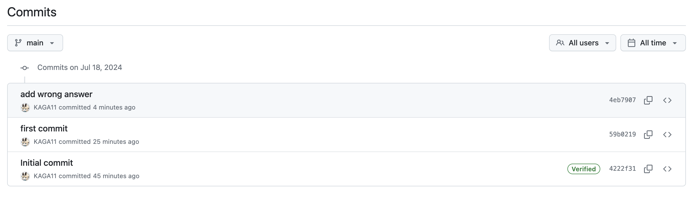
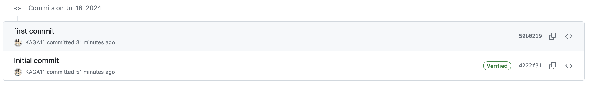
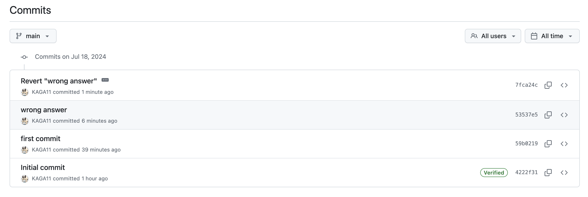

# git撤回操作指南

#### warm-up

​	关于撤回你需要用到 `git reset`, 以下是参数解释:

1. **`--soft`**：
   - 保留变更在暂存区，这意味着你可以继续编辑这些文件或者直接重新提交
   - 不带参数的`git reset --soft` 等同于`git reset --soft HEAD` (当前所在的提交,保留工作目录和暂存区的更改)
   - `git reset --soft HEAD~1`：将当前分支的 HEAD 移动到上一个提交，但保留工作目录和暂存区的更改
2. **`--mixed`**（默认选项）：
   - 撤销提交并将变更保留在工作目录中，但移除暂存区的变更
   - `git reset --mixed HEAD~1`：撤销上一次提交，并且取消对文件的暂存，但保留文件内容的更改
3. **`--hard`**：
   - 完全撤销提交，并删除工作目录中的所有更改
   - 不带参数的`git reset --hard` 等同于`git reset --hard HEAD` (当前所在的提交,删除工作目录中的所有更改)
   - `git reset --hard HEAD~1`：将 HEAD 移动到上一个提交，删除所有的暂存和工作目录中的更改
4. **`HEAD`**：
   - `HEAD` 指向当前的提交
   - `HEAD~1` 指向当前提交的上一个提交
   -  `HEAD~n` 指向更早的提交，其中 `n` 是需要回退的提交数

比如这有一个文件`1.txt`和两段提交:



如果我们在`1.txt`里随便写上什么, 然后执行`git reset --hard`, git就把写的东西删除，恢复到当前HEAD也就是'first commit'的文件



**更直接的方式是reset到对应的版本号(git log中commit后黄色的哈希值)`git reset --soft <版本号>`**


#### 1.本地撤回`git add` 和 `git commit`

##### 	1.撤回`git add` 

​	如果你已经使用 `git add .` 或 `git add <file>` 将文件添加到暂存区，但还没有提交，可以使用以下命令将文件从暂存区移除：

​	这一步只是将文件从暂存区移除, 会保留你对文件内容的更改

```sh
git reset <file>
git reset // 撤回所有已添加的文件
```

##### 	2.撤回`git commit` 

​	如果已经提交 `git commit -m "some message"` 但尚未push到远程仓库，可以使用以下命令撤回最后一次提交：

`	--soft` 选项会保留文件在暂存区中，这样你可以对其进行修改后再次提交。

​	这里需要`HEAD~1`的原因是HEAD已经变成commit后新的那一个了

```sh
git reset --soft HEAD~1
```


#### 2.远程撤回`git push` 

##### 1.撤回最后一次提交

假设我们错误推送了一次到远程仓库：



- 如果想撤回最后一次提交，并且确保其他人还没有从远程仓库拉取这次提交，可以使用：

  ```bash
  git reset --hard HEAD~1 // 或者直接reset到你想要的commit的版本号
  git push origin <branch> --force
  ```

可以看到这条记录已经被删除了



注意：`--force` 选项会覆盖远程仓库的历史记录，如果其他人已经从远程仓库拉取了这次提交，可能会导致问题(分支不一致, 丢失提交)


##### 2.使用 `git revert`:

​	如果你不想强制覆盖远程仓库的历史，可以使用 `git revert` 创建一个新的提交，撤销之前的更改：

```
git log //获取需要revert的hash值 
git revert <commit> //commit就是log中获取的hash值
git push origin <branch>
```

这将生成一个新的提交，revert指定提交的更改，从而保持提交历史的完整性。

